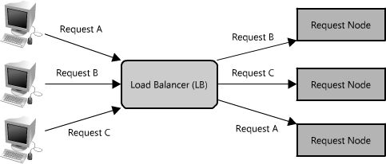

[可扩展的Web架构和分布式系统 \| nettee 的 blog](https://nettee.github.io/posts/2016/Scalable-Web-Architecture-and-Distributed-Systems/#comments)

## Web分布式系统和设计的原则
- 可用性 Availability
- 性能 Performance
- 可靠性 Reliability
- 可拓展性 Scalability
- 可管理性 Manageability
- 成本 Cost
这些原则之间可能产生冲突，需要折中考虑。

## 基础
这一节主要讨论对几乎所有的大型Web应用都很重要的一些核心因素：**服务(service)、冗余(redundancy)、分区(partition)、故障处理(handling failure)**。

---
例子：图片托管应用
我们假设这个应用有两个主要的部分：上传（写）图片到服务器的能力，以及请求一个图片的能力。我们当然希望上传是高效的，但我们更关注的是当请求一个图片时（如为一个网页请求图片），图片能快速地传送。
系统的其他重要方面：
- 可以存储的图片数量没有限制，因此在图片数量上的可扩展性需要考虑
- 图片的下载/请求需要低延迟
- 如果用户上传了一张图片，这个图片要一直存在（即数据可靠性）
- 系统应当易于维护（可管理性）
- 由于图片托管利润率不高，系统需要较高的性价比

在这个图片托管的示例中，系统必须要足够快，数据存储可靠，所有的属性高度可扩展。

### 服务 service
当考虑可扩展性系统设计时，对功能进行解耦，并将系统的每一个部分各自考虑成具有清晰定义的接口的服务。这就是面向服务的架构SOA。
将系统拆解为一些互补的服务的集合，可以将对这些部分的管理分离开。由于系统需要扩展，将这两个功能（上传和检索）分解成两个服务是有意义的。
存在的问题是：写入和读取会竞争，并且写入总是比读取慢。
像Apache和lighttped这样的Web服务器可维护的同时连接数有上限（默认500）。流量很大的情况下，写操作会占用所有连接，而读操作可以异步，并且还有其他的性能优化技术（gzip压缩或分块传输编码）。
为这种瓶颈做计划的话，==读写分离==是很好的做法。既可以独立进行拓展，也可以关注点分离，排解故障容易。

Flickr解决这个读/写问题的方法是将将用户分布到不同的shard上。每个shard只能处理一小部分的用户，在用户数量增长时，将更多的shard加入集群中。
在第一个例子中，基于实际使用（整个系统的读/写数）很容易扩展硬件，然而Flickr是基于用户基数扩展（但强制假设用户使用量均等，这样会有额外的容量）。在第一个例子中，断电或服务故障会使整个系统的功能失效（例如，没有人可以写文件），而Flickr的一个shard的断电却只会影响它关联的那些用户。在第一个例子中，在全部的数据集上进行操作很容易——比如更新写服务，使之包含新的元数据或在所有的元数据中搜索，而在Flickr的架构上每个shard都需要更新或搜索（或者，需要创建一个搜索服务，整理元数据——他们实际上就是这么干的）。

对于这些系统架构，没有一个最终正确的答案。但我们应当回到本章开头的那些原则，判断系统的需要（重度读还是重度写，并发层级，数据集上的请求，范围，排序，等等），衡量不同的替代品，理解系统是如何失效的，并对失效发生有一个清晰的应对计划。这些都对建立一个好的系统架构很有帮助。

### 冗余 redundancy
为了优雅地处理失效问题，一个Web架构必须有服务和数据的冗余。同样的原则也适用于服务。
在系统中创建冗余可以消除单点失效问题，并在发生危机时提供备份或多余的功能。如果一个失败或退化，可以故障转移到另一个健康的拷贝上。
服务冗余的另一个关键部分是创建一个_无共享架构_(shared-nothing architecture)。在这个架构中，每个结点都可以独立于其他结点运行，没有中央的管理状态的“大脑”，也也没有和其他结点协调进行的活动。在对可扩展性很有好处，因为新结点的添加不需要特殊条件和知识。然而最重要的是，这些系统中的没有单点故障，所以他们在失效后更容易恢复。

### 分区 partition
数据集可能会有很大，导致单个服务器装不下；也可能是一个操作需要太多的计算资源，降低了性能，导致必须增加容量。在这样的情况下你有两种选择：垂直分区或是水平分区。
==垂直扩展==意味着在一个服务器上增加更多的资源。因此对于很大的数据集，这可能意味着增加更多（或更大的）硬盘驱动器，使一个服务器可以包含整个数据集。对于计算操作，这可能意味着将计算移动到有更快的CPU、更大的内存的服务器上。对于每种情况，垂直扩展总是通过使个体的资源的能力更强来实现。
另一方面，==水平扩展==则是增加更多的结点。对于很大的数据集，这可能是有第二个服务器来存储部分数据。对于计算操作，这可能意味着将操作或负载分离到某个额外的结点上。为了充分利用水平扩展，它需要作为系统架构的固有设计原则引入，否则为它修改和分离出环境会相当麻烦。
水平拓展最常见的就是将服务分解为多个分区，或是多个shard。分区是可以分开的，于是每个逻辑功能集都分开了。可以按地理的边界划分分区，或是用其他标准，如免费用户和付费用户。这种计划的好处是为服务或数据提供了增加的容量。

将数据或功能分布在多个服务器上当然是有挑战的。一个主要的问题就是_数据局部性_(data locality)。在分布式系统中，数据距离操作或计算点越近，系统的性能就越好。因此将数据散播在多个服务器上可能会有问题，因为当需要的数据不在本地的时候，就迫使服务器进行在网络上请求信息的昂贵操作。
另一个潜在的问题是_不一致_(inconsistency)。当有多个服务从一个共享的资源（可能是另一个服务或数据存储）读写时，有可能产生竞争条件(race condition)

## 快速可拓展数据访问构件
设计分布式系统比较难的部分：拓展数据访问。
扩展对应用服务器的访问，和对数据库的访问。在高度可扩展的应用设计中，一个应用服务器（或Web服务器）通常是最小化的，包含一个无共享架构。这使系统中的应用服务器层水平可扩展。这种设计导致负担传递到栈下层的数据库服务器和配套服务上，在这一层才是扩展和性能的挑战真正起作用的地方。
从磁盘读比从内存读慢很多，对于浮点数，内存在顺序读的情况下比磁盘快6倍，在随机读的情况下比磁盘快100000倍。
**四个常见的策略是缓存、代理、索引和负载均衡器。**

### 缓存
缓存利用的是引用的局部性原理。缓存被用在计算机的几乎所有层次：硬件，操作系统，浏览器，Web应用，等等。
一个选择就是将缓存插入请求层节点。不论是缓存在内存中，还是放在结点的磁盘中，都要比网络获取要快。
如果将缓存扩展到多个结点上会怎么样呢？如果请求层扩展到多个结点，每个结点仍很有可能拥有自己的缓存。然而，如果你的负载均衡器随即地在结点间分发请求，同一个请求可能发往不同的结点，这会增加缓存不命中的次数。克服这个障碍的两种选择是：**全局缓存和分布式缓存。**

全局缓存：
所有的结点使用相同的单一缓存空间。全局缓存有两种形式：
缓存负责获取数据

请求节点负责获取数据

使用全局缓存的应用大部分倾向于使用第一种，因为缓存自己管理了数据的回收和获取，防止了从客户端大量请求相同的数据。
在读取很大文件的时候，缓存无法理解哪些数据是热点数据，会导致命中率下降。而第二种方式是应用逻辑选择回收策略和热点。

分布式缓存：
每个结点都拥有一部分缓存数据
通常，缓存是用一个全局唯一的散列函数分割的，一个请求结点寻找特定数据时，可以快速知道去哪个缓存上寻找，判断数据是否可获取。分布式缓存的一个好处就是增加了缓存空间，且只需要为请求池增加结点就可以实现。
分布式缓存的一个缺点是补救缺失结点。一些分布式缓存通过在不同的结点上存储数据的多个拷贝来对付这种情况。然而逻辑会变得极端复杂。
缓存的好处是使得一切变快，然而通常需要昂贵的内存。

### 代理
在基础层面上，代理服务器是一个硬件/软件的中间片，从客户端接收请求，并转播到后端服务器。代理通常用来过滤请求和记录请求，有时候也用来变换请求（通过增加/删除头部，加密/解密，或是压缩）。

代理在将来自多个服务器的请求整合在一起的时候也非常有用，提供了从整个系统角度优化请求量的机会。使用代理加速数据访问的一种方法是将相同或相似的请求压缩为一个，然后为发送请求的客户端返回同一个结果。这就是压缩转发(collapsed forwarding)。
压缩转发这种做法在高负载，尤其是一些数据被一次又一次地请求的情况下，会大幅提升性能。这和缓存很像，但与缓存将数据/文档存储起来不同，代理是优化对文档的请求或调用，充当这些客户的代理人。
另一个使用请求的很好方式是不仅仅压缩对同一个数据的请求，还压缩对原存储中相距很近（在磁盘上连续）的数据的请求。使用这个策略最大化了请求的数据局部性，可以降低请求延迟。

同时使用代理和缓存，但通常最好将缓存放在代理前面。

[Squid](http://www.squid-cache.org/)和[Varnish](https://www.varnish-cache.org/)

|特性|**Squid**|**Varnish**|
|---|---|---|
|出现时间|较早（1996）|较晚（2006）|
|协议支持|HTTP、HTTPS、FTP 等多种协议|仅 HTTP|
|应用场景|正向代理 + 反向代理 + 内容过滤|专注反向代理（网站加速）|
|配置方式|配置文件 + ACL|VCL 脚本，灵活性更高|
|性能|一般，高并发时不够快|极高，适合大型网站|
|常见用途|企业代理、防火墙、流量控制|电商、新闻门户、CDN 节点缓存|
- **Squid**：全能选手，代理 + 缓存 + 访问控制，功能全面但性能一般。
- **Varnish**：专精选手，只做 **HTTP 缓存加速**，性能极致，适合高流量网站。

### 索引
索引通过增加存储开销和写操作时间（因为你必须同时写数据和更新索引）来换取更快的读。
索引通常是存储在内存中，或是在距离客户请求很近的地方。人们通常使用Berkeley DBs(BDBs)和树形的数据结构来将数据以顺序表的形式存储，这种结构非常适合索引的访问。
大规模搜索系统采用分层索引。

### 负载均衡器
将负载分布到负责请求服务的结点上，使系统中多个结点可以透明地服务同一个功能。主要目标是处理很多相同的连接，并将这些连接发送到其中一个请求结点(request node)，使系统得以扩展，通过增加结点服务更多的请求。

服务请求有很多算法可以使用，包括随机挑选结点，轮流选择，甚至是基于内存或CPU利用率挑选结点。负载均衡器可以实现为软件或硬件应用。
在一个分布式系统中，负载均衡器通常是在系统的最前端，于是所有进来的请求都经它发送。在一个复杂的分布式系统中，一个请求经过多个负载均衡器并不少见。
和代理一样，一些负载均衡器也可以根据请求的类型不同发往不同的结点。（反向代理）

|特性|正向代理|反向代理|
|---|---|---|
|代理对象|客户端|服务器|
|谁被隐藏|客户端|服务器|
|客户端是否感知|**知道目标服务器**，但要借助代理才能访问|**不知道目标服务器**，只知道代理|
|常见用途|翻墙、缓存、隐藏客户端|负载均衡、安全防护、加速、隐藏服务器|
|举例|VPN、Shadowsocks、Squid|Nginx、Apache Traffic Server、CDN|
负载均衡器的一个挑战是处理特定于用户会话的数据。一个解决方法是使会话有黏性，同一个用户的请求总是发送到相同的结点上，但这样就很难利用一些可靠性功能如自动故障转移。也可以通过浏览器缓存，cookie解决。
如果系统只有少数几个结点，循环式DNS之类的会更有用，因为负载均衡器可以会很昂贵，而且增加了一层不必要的复杂性。当然在大型系统中有各种不同的调度和负载均衡算法，包括简单的随机抽取和循环式，和更复杂的如考虑利用率和容量。所有这些算法都允许分布流量和请求，而且可以体用有用的可靠性工具如自动故障转移，或自动移除坏点（像不可响应的结点）。然而，这些高级特性会使错误诊断变得很麻烦。

### 队列
目前我们已经谈论了很多快速读数据的方法，但扩展数据层的另一个重要的部分是对写的高效管理。在写操作（或其他类似的任务）可能占用很长时间的情况下，追求性能和可用性需要在系统中建立异步机制，常见的办法就是使用队列。
队列使客户可以用异步的方式工作，提供了一个对客户请求和响应策略上的抽象。另一方面，在同步系统中，请求和回复没有区别，因此也不能分别管理。在异步系统中，客户请求一个任务，服务端响应一个消息，确认任务收到，然后客户就可以周期性检查任务状态，只在任务完成之后请求结果。在客户等待异步请求完成时，它可以随意进行其他工作，甚至是发送其他服务的异步请求。
队列还提供了一些保护，免于服务中断和失效。