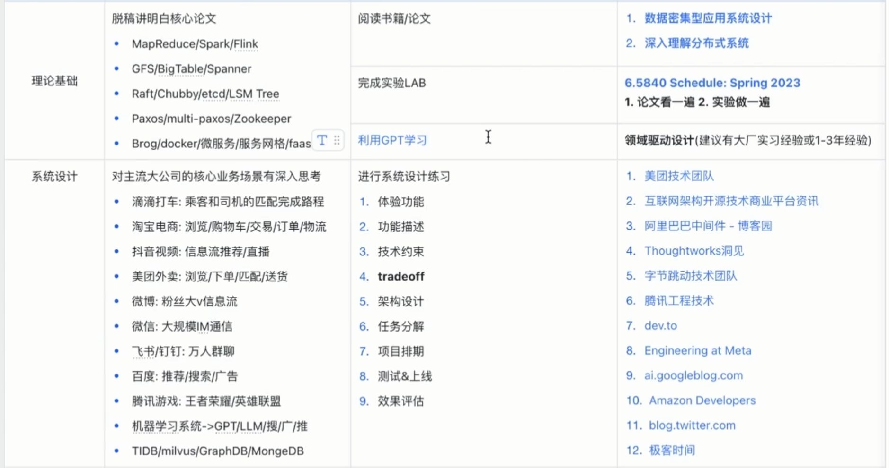
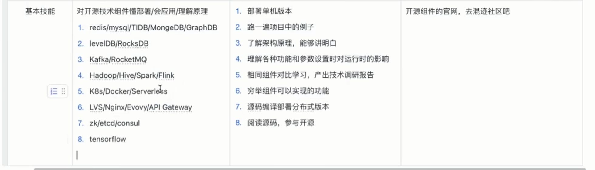

互联网大厂目前对`KV`数据库和`KV`存储的需求是很多的, 因此除了`6.824`和`15445`之外最后还要有`KV`存储相关的项目经验, 这里我推荐`LSM Tree`项目, 我知道的项目学习资源有:

1. [Mini-LSM Overview - LSM in a Week](https://link.zhihu.com/?target=https%3A//skyzh.github.io/mini-lsm/00-overview.html)
2. [talent-plan/tinykv: A course to build distributed key-value service based on TiKV model](https://link.zhihu.com/?target=https%3A//github.com/talent-plan/tinykv)

**最后我自己写了个新人的LSM-Tree存储引擎的教程, 欢迎支持:**

1. **代码仓库:** [Vanilla-Beauty/tiny-lsm: A KV storage engine based on LSM Tree, supporting Redis RESP](https://link.zhihu.com/?target=https%3A//github.com/Vanilla-Beauty/tiny-lsm)
2. **开源课程地址:** [Lab 介绍 - Tiny-LSM-Lab](https://link.zhihu.com/?target=https%3A//vanilla-beauty.github.io/tiny-lsm/book/)

