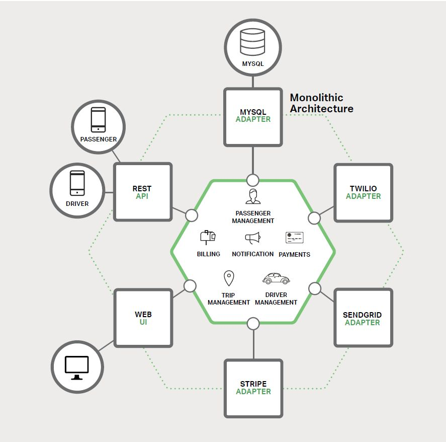
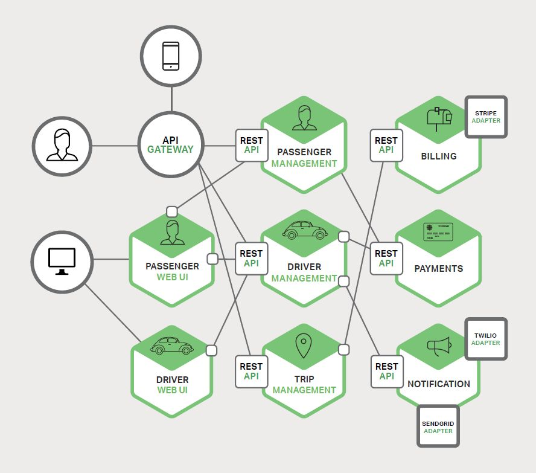
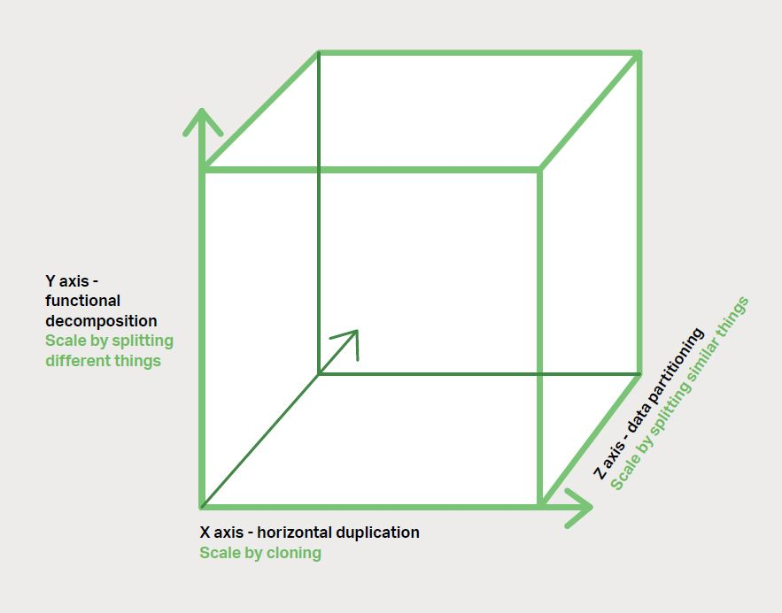
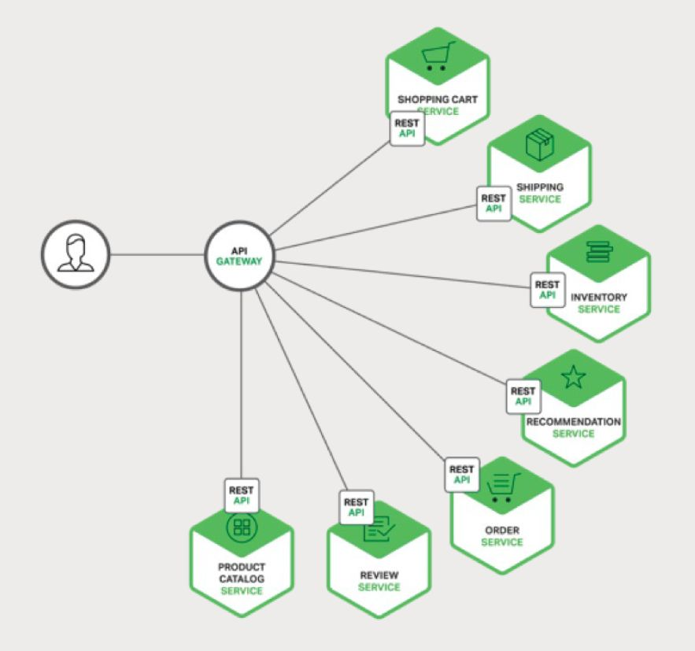

[Introduction \| 微服务：从设计到部署](https://docshome.gitbook.io/microservices)
## 0. 引言
近年来，微服务在应用开发和部署方面取得了显著的进步。将应用开发或重构成微服务以分离服务，通过 API 以明确的方式相互调用。比如，每个微服务都是自包含（self-contained），各自维护自己的数据存储，可以独立更新其他服务。
微服务使得应用程序开发变得更快更容易管理，它只需要较少的人力就能实现更多的功能，可以更快更容易地部署。将应用程序设计成一套微服务，它更加容易在多台有负载均衡的服务器上运行，而且能轻松应对需求高峰、由于时间推移而平稳增长的需求和由于硬件或者软件问题导致的宕机事故。
微服务的最大进步在于改变了我们的工作方式。敏捷软件开发技术、应用迁移云端、DevOps 文化、持续集成与持续部署（CI/CD）和容器应用都使用了微服务来革新应用开发与交付。

**本书章节：**
1. **微服务简介**
    
    从被夸大的微服务概念到如何在创建和维护应用时部署微服务进行简单介绍。
    
2. **使用 API 网关**
    
    API 网关是整个微服务应用的单入口，它为每一个微服务提供了 API。NGINX Plus 可以很好地应用在 API 网关层，它提供了负载均衡和静态文件缓存等功能。
    
3. **微服务架构中的进程间通信**
    
    当把一个单体应用分解成几部分，它们就需要相互通信。事实上有许多进程间通信的方案可以选择，包括表述性状态转义（REST）。本章将详细介绍。
    
4. **微服务架构中的服务发现**
    
    当服务运行在一个动态环境中，想要找到它们并不是一件容易的事情。
    
5. **微服务事件驱动数据管理**
    
    每个微服务仅维护自己特有的数据展示与存储，而不是共享一个统一、跨越一个或多个单体应用的数据存储。这种方式很灵活，但也可能导致变得复杂。本章可以帮助你理清这些问题。
    
6. **选择微服务部署策略**
    
    DevOps 中的每一步都很重要。Chris 讲解了微服务部署的主要模式，以便你可以为应用部署作出合理的选择，
    
7. **重构单体应用为微服务**
    
    理想环境下，我们不会缺少时间与金钱，因此可以将核心软件转化为最新最好的技术、工具和方法。然而你可能会发现自己正在将一个单体应用重构为微服务，而且进展非常缓慢。Chris 在本章中为你讲解明智的做法。

## 1. 微服务简介
在此章节中，你将了解到微服务的由来和其与传统[单体应用模式](http://microservices.io/patterns/monolithic.html)的区别。
### 1.1 构建单体应用

应用的核心是由模块实现的业务逻辑，这些模块定义了服务、领域对象和事件。围绕核心的是与外部世界接口对接的适配器。适配器示例包括数据库访问组件、生产和消费消息的消息组件和暴露了 API 或实现了一个 UI 的 web 组件。
尽管应用有一个逻辑模块化架构，但它被作为一个单体进行打包和部署。
==优点：简单，便于开发与测试，可以通过运行多个副本并结合负载均衡来扩展应用。在项目的早期阶段，它可以良好地运作。==
### 1.2 走向单体地狱
1. 随着时间的推移，应用会变的越来越臃肿，导致开发困难。
2. 应用的规模也会减缓发展；应用越大，启动时间越长。
3. 另外一个障碍就是持续部署的障碍。SaaS可以每天多次将变更推送到生产环境。对于复杂的单体，需要重新部署整个应用才能更新其中一部分。持续部署是不可能做到的。
4. 当不同的模块存在资源需求冲突时，单体应用可能会难以拓展。例如，有的模块时CPU密集型应用，有的模块时IO密集型应用，不同的模块适用于不同侧重点的服务器。
5. 单体应用的另一个问题是可靠性。因为所有模块都运行在同一进程中。任何模块的一个 bug，比如内存泄漏，都可能会拖垮整个进程。此外，由于应用的所有实例都是相同的，错误将影响到整个应用的可用性。
6. 单体应用使得采用新框架和语言变得非常困难

### 1.3 微服务--解决复杂问题
思路是将应用分解成一套较小的互连服务。
一些微服务会暴露一个供其他微服务或应用客户端消费的 API。其他微服务可能实现一个 web UI。在运行时，每个实例通常是一个云虚拟机（virtual machine，VM）或者一个 Docker 容器。
前面的系统可能分解为：

应用的每个功能区域现在都由自己的微服务实现。此外，Web 应用被划分为一组更简单的应用。例如，以我们的出租车为例，一个是乘客的应用，一个是司机的应用。这样更容易为特定的用户、司机、设备或者专门的用例部署不同的场景。每个后端服务暴露一个 REST API，大部分服务消费的 API 由其他服务提供。
一些 REST API 也暴露给移动端应用供司机和乘客使用。然而，应用不能直接访问后端服务。相反，他们之间的通信是由一个称为 [API 网关](http://microservices.io/patterns/apigateway.html)（API Gateway）的中介负责。API 网关负责负载均衡、缓存、访问控制、API 度量和监控。

微服务架构模式相当于此伸缩立方的 Y 轴坐标，此立方是一个来自[《架构即未来》](http://theartofscalability.com/)的三维伸缩模型。另外两个坐标轴是由运行多个相同应用副本的负载均衡器组成的 X 轴坐标和 Z 轴坐标（或数据分区）。
微服务架构模式明显影响到了应用与数据库之间的关系，与其他共享单个数据库模式（schema）的服务有所不同，其每一个==服务都有自己的数据库模式==。一方面，这种做法与企业级数据库数据模型的思想相背，此外，它经常导致部分数据冗余。然而，如果你想从微服务中受益，每一个服务都应该有自己的数据库模式，因为它能实现松耦合。
从表面上看，微服务架构模式类似于 SOA。微服务是由一组服务组成。然而，换另一种方式去思考微服务架构模式，它是没有商业化的 SOA，没有集成 [Web 服务规范](http://en.wikipedia.org/wiki/List_of_web_service_specifications)（WS-*）和企业服务总线（Enterprise Service Bus，ESB）。

### 1.4 微服务的优点
- 解决了复杂问题，将单体拆分为一套服务。
- 这种架构使得每个服务都可以由一个团队独立专注开发。
- 微服务架构模式可以实现每个微服务独立部署。
- 微服务架构模式使得每个服务能够独立扩展。

### 1.5 微服务的缺点
- 微服务这个术语的重点过多偏向于服务的规模。可能会导致服务分解过多
- 由于微服务是一个分布式系统，其使得整体变得复杂
- 另一个挑战是分区数据库架构
- 测试微服务也很复杂，需要启动该服务及其依赖的所有服务
- 需要协调多服务的变更
- 部署困难

### 1.6 总结
构建复杂的微服务应用本质上是困难的。单体架构模式只适用于简单、轻量级的应用，如果你使用它来构建复杂应用，你最终会陷入痛苦的境地。对于复杂、持续发展的应用而言，微服务架构模式是一个更好的选择。尽管它存在着缺点和挑战。

## 2 使用API网关
当你选择将应用构建成为一组微服务时，你需要决定应用客户端将如何与微服务进行交互。单体应用只有一组端点（endpoint），通常使用副本（replicated）结合负载均衡来分配流量。
然而，在微服务架构中，通常每个微服务都暴露一组比较细颗粒的端点。在本文中，我们将研究如何改进客户端通信，并提出一个使用 API 网关的方案。
### 2.1 客户端与微服务直接通信
不幸的是，这种方式存在着挑战与限制。第一个问题是客户端的需求与每个微服务暴露的细粒度的 API 不匹配。
客户端直接调用微服务的另一个问题是有些服务可能使用了非 web 友好协议。一个服务可能使用了 Thrift 二进制 RPC，而另一个则可能使用 AMQP 消息协议。这两个协议无论是对浏览器还是防火墙来说都是不友好的，最好是在内部使用。应用在防火墙之外应该使用 HTTP 或者 WebSocket 之类的协议。
这种方法的另一个缺点是它难以重构微服务。随着时间推移，我们可能会想改变系统划分服务。
由于以上问题，很少有客户端直接与微服务进行通信。

### 2.2 使用API网关
通常更好的方式是使用 API 网关。API 网关是一个服务器，是系统的单入口点。它类似于面向对象设计模式中的门面（Facade）模式。API 网关封装了内部系统架构，并针对每个客户端提供一个定制 API。它还可用于认证、监控、负载均衡、缓存和静态响应处理。

API 网关负责请求路由、组合和协议转换。所有客户端请求首先要通过 API 网关，之后请求被路由到适当的服务。API 网关通常会通过调用多个微服务来处理一个请求并聚合结果。它可以在 Web 协议（如 HTTP 和 WebSocket）和用于内部的非 Web 友好协议之间进行转换。

### 2.3 API网关的优点与缺点
优点：
- 封装了应用的内部结构，客户端只需要与网关通信，而不必调用特定的服务
- 为每种类型的客户端提供了特定的 API，减少了客户端与应用之间的往返次数
- 简化了客户端的代码
缺点：
- 本身也是一个高度可用的组件，需要开发、部署和管理
- API 网关可能会成为开发瓶颈，开发人员必须更新 API 网关来暴露每个微服务的端点。

### 2.4 实现API网关
（1）性能与可拓展性
在一个支持异步、非阻塞 I/O 平台上构建 API 网关是很有必要的
（2）使用响应式编程模型
API 网关处理大部分请求只是简单的把它们路由到与之对应的后端服务。它通过调用多个后端服务来处理其他请求并聚合结果。为了把响应时间缩短到最小，API 网关应该并发执行独立请求。
使用传统的异步回调方式来编写 API 组合代码会很快使你陷入回调地狱。代码将会变得杂乱、难以理解并且容易出错。更好的方式是使用响应式方法以声明式方式编写 API 网关代码。
（3）服务调用
基于微服务的应用是一个分布式系统，必须使用进程间（inter-process）通信机制。有两种进程间通信方案。一是使用基于消息的异步机制。某些实现采用了消息代理，如 JMS 和 AMQP。其他采用无代理的方式直接与服务通信，如 Zeromq。
另一种类型的进程间通信采用了同步机制，如 HTTP 和 Thrift。系统通常会同时使用异步和同步方式。甚至可以为每种方式应用多个实现。因此，API 网关需要支持各种通信机制。
（4）服务发现
API 网关需要知道与其通信的每个微服务的位置（IP 地址和端口）。在传统应用中，你可以将这些位置硬编码，但在现代基于云的微服务应用中，找到所需的位置不是一件简单的事情。
应用服务可以动态分配位置。此外，由于自动扩缩和升级，一个服务的整组实例可以动态变更。因此，API 网关与系统中的任何其他服务客户端一样，需要使用系统的服务发现机制：[服务端发现](http://microservices.io/patterns/server-side-discovery.html)或[客户端发现](http://microservices.io/patterns/client-side-discovery.html)。
（5）处理局部故障
当一个服务调用另一个响应缓慢或者不可用的服务时，所有分布式系统都会出现此问题。API 网关不应该无期限地等待下游服务。

### 2.5 总结
对于大多数基于微服务的应用来说，实现一个 API 网关是很有必要的，API 网关作为系统的单入口点，并且负责请求路由，组合和协议转换。它为每个应用客户端提供了一个自定义 API。API 网关还可以通过返回缓存或默认数据来掩盖后端服务故障。

## 3 进程间通信
在单体应用中，组件可通过语言级方法或者函数相互调用。相比之下，基于微服务的应用是一个运行在多台机器上的分布式系统。通常，每个服务实例都是一个进程。
因此，服务必须使用进程间通信（IPC）机制进行交互。

### 3.1 交互方式
当为服务选择一种 IPC 机制时，首先需要考虑服务如何交互。有许多种客户端/服务交互方式。可以从两方面对它们进行分类。交互方式是一对一还是一对多：

- **一对一** — 每个客户端请求都由一个服务实例处理。
    
- **一对多** — 每个请求由多个服务实例处理。
    

交互是同步的还是异步的：

- **同步** — 客户端要求服务及时响应，在等待过程中可能会发生阻塞。
    
- **异步** — 客户端在等待响应时不会发生阻塞，但响应（如果有）不一定立即返回。
    

下表展示了各种交互方式。

以下为一对一交互，包括同步（请求/响应）与异步（通知与请求/异步响应）：

- **请求/响应**
    
    客户端向服务发出请求并等待响应。客户端要求响应及时到达。在基于线程的应用中，发出请求的线程可能在等待时发生阻塞。
    
- **通知（又称为单向请求）**
    
    客户端向服务发送请求，但不要求响应。
    
- **请求/异步响应**
    
    客户端向服务发送请求，服务异步响应。客户端在等待时不发生阻止，适用于假设响应可能不会立即到达的场景。
    

一对多交互，它们都是异步的：

- **发布/订阅**
    
    客户端发布通知消息，由零个或多个服务消费。
    
- **发布/异步响应**
    
    客户端发布请求消息，之后等待一定时间来接收消费者的响应。
    

通常，每个服务都组合着使用这些交互方式。对一些服务而言，单一的 IPC 机制就足够了，但其他服务可能需要组合多个 IPC 机制。

### 3.2 定义API
服务 API 是服务与客户端之间的契约。无论你选择何种 IPC 机制，使用接口定义语言（interface definition language，IDL）来严格定义服务 API 都是非常有必要的。有论据证明使用 [API 优先法](https://www.programmableweb.com/news/how-to-design-great-apis-api-first-design-and-raml/how-to/2015/07/10)定义服务更加合理。在对需要实现的服务的 API 定义进行迭代之后，你可以通过编写接口定义并与客户端开发人员进行审阅来开始开发服务。这样设计可以增加你成功的机率，以构建出符合客户端需求的服务。
> 定义 API 的方式取决于你使用何种 IPC 机制。如果你正在使用消息传递，那么 API 是由消息通道和消息类型组成。如果你使用的是 HTTP，那么 API 是由 URL、请求和响应格式组成。

### 3.3 演化API
服务 API 总是随着时间而变化。在单体应用中，更改 API 和更新所有调用者通常是一件直截了当的事。但在基于微服务的应用中，即使 API 的所有消费者都是同一应用中的其他服务，要想完成这些工作也是非常困难的。通常，你无法强制所有客户端与服务升级的节奏一致。此外，你可能需要[逐步部署服务的新版本](http://techblog.netflix.com/2013/08/deploying-netflix-api.html)，以便新旧版本的服务同时运行。
处理API变更的方式取决于变更的程度。如果变更较少，则可以服务端客户端协调，服务端为缺少的请求属性设置默认值，客户端忽略所有多余的响应属性即可；如果变更较大，一个办法就是将版本号嵌入到URL中，每个服务实例可以同时处理多个版本。

### 3.4 处理局部故障
处理局部故障的策略包括：

- **网络超时**
    
    在等待响应时，不要无限期地阻塞，始终使用超时方案。使用超时方案确保资源不被无限地消耗。
    
- **限制未完成的请求数量**
    
    对客户端请求的某些服务，设置未完成请求的数量上限。如果达到了上限，发出的额外请求可以视为毫无意义，因此这些尝试需要立即失败。
    
- [**断路器模式**](http://martinfowler.com/bliki/CircuitBreaker.html)
    
    追踪成功和失败请求的数量。如果错误率超过配置阈值，则断开断路器，以便后续的尝试能立即失败。如果出现大量请求失败，则表明服务不可用，发送请求将毫无意义。发生超时后，客户端应重新尝试，如果成功，则关闭断路器。
    
- **提供回退**
    
    请求失败时执行回退逻辑。例如，返回缓存数据或者默认值，可以是一组空白的推荐数据。

如果在JVM环境下可以尝试Hystrix

### 3.5 IPC技术
有多种 IPC 技术可供选择。服务可以使用基于同步请求/响应的通信机制，比如基于 HTTP 的 REST 或 Thrift。或者，可以使用异步、基于消息的通信机制，如 AMQP 或 STOMP。

还有各种不同的消息格式。服务可以使用可读的、基于文本的格式，如 JSON 或 XML。或者，可以使用如 Avro 或 Protocol Buffers 等二进制格式（更加高效）。稍后我们将讨论同步 IPC 机制，但在此之前让我们先来讨论一下异步 IPC 机制。

### 3.6 异步、基于消息的通信
当使用消息传递时，进程通过异步交换消息进行通信。客户端通过发送消息向服务发出请求。如果服务需要回复，则通过向客户端发送一条单独的消息来实现。由于通信是异步的，因此客户端不会阻塞等待回复。相反，客户端被假定不会立即收到回复。
一条[消息](http://www.enterpriseintegrationpatterns.com/patterns/messaging/Message.html)由头部（如发件人之类的元数据）和消息体组成。消息通过[通道](http://www.enterpriseintegrationpatterns.com/patterns/messaging/MessageChannel.html)进行交换。任何数量的生产者都可以向通道发送消息。类似地，任何数量的消费者都可以从通道接收消息。有两种通道类型，分别是[点对点](http://www.enterpriseintegrationpatterns.com/patterns/messaging/PointToPointChannel.html)（point‑to‑point）与[发布订阅](http://www.enterpriseintegrationpatterns.com/patterns/messaging/PublishSubscribeChannel.html)（publish‑subscribe）：
- **点对点通道**发送一条消息给一个切确的、正在从通道读取消息的消费者。服务使用点对点通道，就是上述的一对一交互方式。
    
- **发布订阅通道**将每条消息传递给所有已订阅的消费者。服务使用发布订阅通道，就是上述的一对多交互方式。

使用消息传递有很多优点：

- **将客户端与服务分离**
    
    客户端通过向相应的通道发送一条消息来简单地发出一个请求。服务实例对客户端而言是透明的。客户端不需要使用发现机制来确定服务实例的位置。
    
- **消息缓冲**
    
    使用如 HTTP 的同步请求/响应协议，客户端和服务在交换期间必须可用。相比之下，消息代理会将消息排队写入通道，直到消费者处理它们。这意味着，例如，即使订单执行系统出现缓慢或不可用的情况，在线商店还是可以接受客户的订单。订单消息只需要简单地排队。
    
- **灵活的客户端 — 服务交互**
    
    消息传递支持前面提到的所有交互方式。
    
- **毫无隐瞒的进程间通信**
    
    基于 RPC 的机制试图使调用远程服务看起来与调用本地服务相同。然而，由于物理因素和局部故障的可能性，他们实际上是完全不同的。消息传递使这些差异变得非常明显，所以开发人员不会被这些虚假的安全感所欺骗。
    

然而，消息传递也存在一些缺点：

- **额外的复杂操作**
    
    消息传递系统是一个需要安装、配置和操作的系统组件。消息代理程序必须高度可用，否则系统的可靠性将受到影响。
    
- **实现基于请求/响应式交互的复杂性**
    
    请求/响应式交互需要做些工作来实现。每个请求消息必须包含应答通道标识符和相关标识符。该服务将包含相关 ID 的响应消息写入应答信道。客户端使用相关 ID 将响应与请求相匹配。通常使用直接支持请求/响应的 IPC 机制更加容易。

### 3.7 同步的请求/响应IPC
当使用基于同步、基于请求/响应的 IPC 机制时，客户端向服务器发送请求。服务处理该请求并返回响应。

在许多客户端中，请求的线程在等待响应时被阻塞。其他客户端可能会使用到异步、事件驱动的客户端代码，这些代码可能是由 [Futures](http://docs.scala-lang.org/overviews/core/futures.html) 或 [Rx Observables](http://reactivex.io/documentation/observable.html) 封装的。然而，与使用消息传递不同，客户端假定响应能及时到达。

有许多协议可供选择，其中有两种流行协议分别是 REST 和 Thrift。我们先来看一下 REST。

#### 3.7.1 REST
REST 是一种使用了 HTTP （几乎总是）的 IPC 机制。
资源是 REST 中的一个关键概念，它通常用于表示业务对象，如客户、产品或这些业务对象的集合。REST 使用 HTTP 动词（谓词）来操纵资源，这些资源通过 URL 引用。例如，GET 请求返回一个资源的表述形式，可能是 XML 文档或 JSON 对象形式。POST 请求创建一个新资源，PUT 请求更新一个资源。
许多开发人员声称其基于 HTTP 的 API 就是 RESTful。然而，正如 Fielding 在那篇博文中所描述的那样，并不都是这样。
使用基于 HTTP 的协议有很多好处：

- HTTP 简单易懂。
    
- 你可以使用浏览器扩展（如 [Postman](https://www.getpostman.com/)）来测试 HTTP API，或者使用 curl 命令行测试 HTTP API（假设使用了 JSON 或其他一些文本格式）。
    
- 它直接支持请求/响应式通信。
    
- HTTP 属于防火墙友好。
    
- 它不需要中间代理，简化了系统架构。
    

使用 HTTP 也存在一些缺点：

- HTTP 仅直接支持请求/响应的交互方式。你可以使用 HTTP 进行通知，但服务器必须始终发送 HTTP 响应。
    
- 因为客户端和服务直接通信（没有一个中间者来缓冲消息），所以它们必须在交换期间都运行着。
    
- 客户端必须知道每个服务实例的位置（即 URL）。如[第二章](https://docshome.gitbook.io/microservices/2-using-an-api-gateway)关于 API 网关所述，这是现代应用面临的一个复杂问题。客户端必须使用服务发现机制来定位服务实例。

#### 3.7.2 Thrift
[Apache Thrift](https://thrift.apache.org/) 是 REST 的一个有趣的替代方案。它是一个用于编写跨语言 [RPC](https://en.wikipedia.org/wiki/Remote_procedure_call) 客户端和服务器的框架。Thrift 提供了一个 C 风格的 IDL 来定义 API。
Thrift 支持多种消息格式：JSON，二进制和压缩二进制。二进制比 JSON 更加高效，因为其解码速度更快。而且，顾名思义，压缩二进制是一种节省空间的格式。当然，JSON 是可读和浏览器友好的。Thrift 还为你提供了包括原始 TCP 和 HTTP 在内的传输协议选择。原始 TCP 可能比 HTTP 更加高效。然而，HTTP 是防火墙友好、浏览器友好并且可读的。

### 3.8 消息格式
有两种主要的消息格式：文本和二进制。基于文本格式的例子有 JSON 和 XML。这些格式的优点在于，它们不仅是人类可读的，而且是自描述的。在 JSON 中，对象的属性由一组键值对表示。类似地，在 XML 中，属性由命名元素和值表示。这使得消息消费者能够挑选其感兴趣的值并忽略其余的值。因此，稍微修改消息格式就可以轻松地向后兼容。
使用基于文本的消息格式的缺点是消息往往是冗长的，特别是 XML。因为消息是自描述的，每个消息除了它们的值之外还包含属性的名称。另一个缺点是解析文本的开销。因此，你可能需要考虑使用二进制格式。
有几种二进制格式可供选择。如果你使用的是 Thrift RPC，你可以使用 Thrift 的二进制格式。如果你可以选择消息格式，比较流行的有 [Protocol Buffers](https://developers.google.com/protocol-buffers/docs/overview) 和 [Apache Avro](https://avro.apache.org/)。这两种格式都提供了一种类型化的 IDL 用于定义消息结构。然而，一个区别是 Protocol Buffers 使用标记字段，而 Avro 消费者需要知道模式才能解释消息。因此，Protocol Buffers 的 API 演化比 Avro 更容易使用。

### 3.9 总结
微服务必须使用进程间通信机制进行通信。在设计服务如何进行通信时，你需要考虑各种问题：服务如何交互、如何为每个服务指定 API、如何演变 API 以及如何处理局部故障。微服务可以使用两种 IPC 机制：异步消息传递和同步请求/响应。为了进行通信，一个服务必须能够找到另一个服务。在第四章中，我们将介绍微服务架构中服务发现问题。