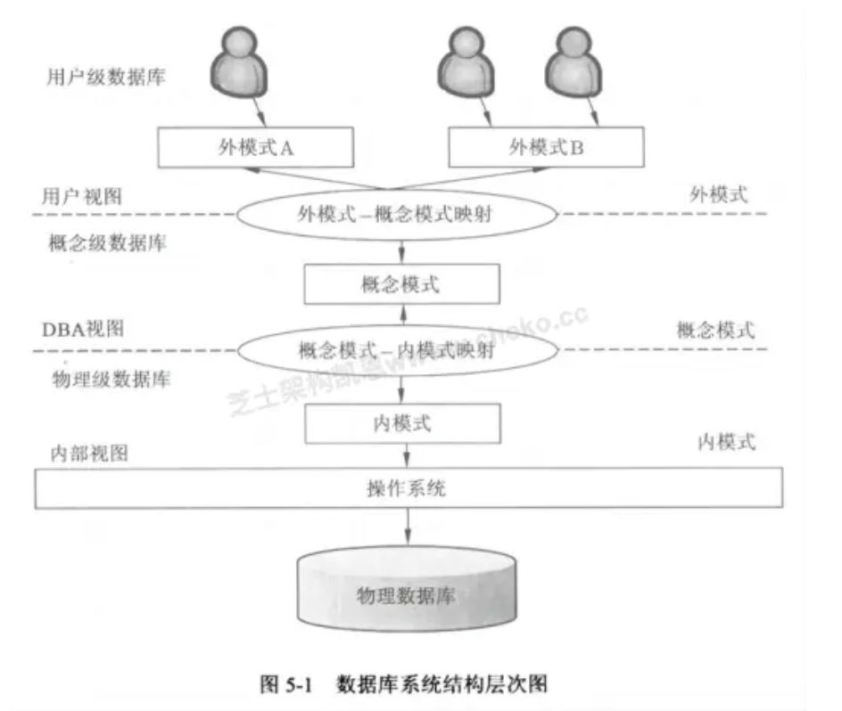
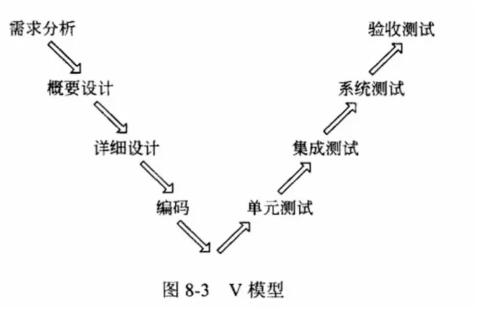
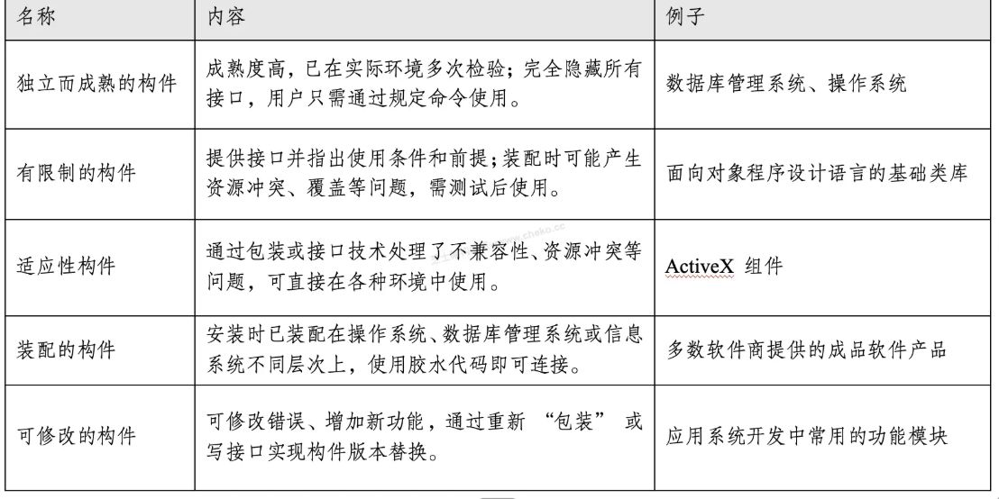

刷题
[Title Unavailable \| Site Unreachable](https://www.cheko.cc/?type=1&_t=1756002537701)
[GitHub - xiaomabenten/ruankao\_itpm: 💯2025年信息系统项目管理师（软考高级）备考资源库。](https://github.com/xiaomabenten/ruankao_itpm)
论文：
文老师软考教育
补充知识：
IT老齐

## 选择题
CMMI的成熟度模型共分为5个等级，分别为：  
**第1级：初始级（Initial）** – 过程是不可预测、反应式的  
**第2级：已管理级（Managed）** – 基本项目管理过程得到实施  
**第3级：已定义级（Defined）** – 过程被文档化、标准化  
**第4级：量化管理级（Quantitatively Managed）** – 使用度量控制过程  
**第5级：优化级（Optimizing）** – 持续过程改进

绝密级不超过三十年，机密级不超过二十年，秘密级不超过十年。

模块内聚耦合程度：记忆口诀“公孙铜锅涮罗欧”。功能 > 顺序 > 通信 > 过程 > 时间（瞬时） > 逻辑 > 偶然。

芯片根据工作温度范围分类：
**民用级（Commercial Grade）**：工作温度范围为 0°C 至 70°C，适用于普通消费电子产品。  
**工业级（Industrial Grade）**：工作温度范围为 -40°C 至 85°C，适用于工业自动化、嵌入式设备等需要适应较宽温度范围的场景。  
**军用级（Military Grade）**：工作温度范围为 -55°C 至 125°C 或更宽，适用于航空航天、军事装备等高可靠性要求场合。

**C/S 与 B/S 架构**
**B/S 架构是一种特殊的三层 C/S 架构**：B/S 架构通常包含表示层（浏览器）、功能层（Web 服务器/应用服务器）和数据层（数据库服务器）
两层 CS 架构新增==应用服务器层==成为三层 CS 架构
经典的两层 CS 架构是表示层（客户端）和数据层（数据库服务器）组成。

ERP 三流是：**物流、资金流、信息流**

RUP 4+1 视图：
- 部署视图描述的是**系统软件单元如何映射到硬件资源上**
- 进程视图关注系统在运行时的行为，特别是**并发性、同步机制、线程模型、进程间通信等运行状态方面的内容**
- **逻辑视图**关注系统的功能结构，是从设计角度描述系统的功能模块
- **实现视图（开发视图）** 描述的是系统的模块组织结构，关注的是代码、包、组件的静态组织

净室软件工程
**净室方法的两个核心理论基础是：** **函数理论（Function Theory）**：用于形式化描述软件系统的行为，强调通过数学函数来构建无错误的软件系统。**抽样理论（Sampling Theory）**：应用在软件的统计测试阶段，通过对输入空间的合理抽样来评估软件的可靠性，而不是全面穷举测试。

软件工程需求跟踪：
正向跟踪是从需求开始，跟踪它们如何在设计、编码和测试中得到实现。
从代码、文档回溯到需求说明书是**逆向跟踪**的定义
双向跟踪包含正向和逆向。

逆向工程建模过程：
逆向能够恢复**实现级**（即原始代码级别的信息，如函数、类、模块等。）和**结构级**（如系统组件之间的调用关系、模块划分、层次结构等架构信息。）。

数据库三级模式（外模式、概念模式、内模式）：
**逻辑模式**，也称概念模式，是数据库的核心抽象层，定义了所有逻辑数据结构以及完整性、安全性等逻辑约束。
**外模式**，即用户子模式，定义了用户能看到的数据子集，并对实际结构做了一定程度的屏蔽。
内模式，描述数据在物理设备上存储的细节。

面向对象继承类型：
**取代继承**：子类继承父类的能力后，用自己的功能**完全取代**父类的实现，强调覆盖关系。  
**包含继承**：子类**完整继承父类的全部特性和能力**，并进一步**从其他类继承了更多内容**，使自身功能**大于等于父类**，实现了对父类的“包含”。  
**受限继承**：只继承父类部分能力或在继承时进行某些限制或裁剪。  
**特化继承**：子类对父类进行了**扩展或细化**，使其成为父类的“特例”，但不一定继承全部内容，更多强调**概念上的子集与约束增强**。

Restful：
部分更新 patch，全部更新 put

实时 OS 调度算法：
实时调度算法分为**硬实时调度算法**和**软实时调度算法**。硬实时调度要求任务必须在截止时间前完成，否则系统可能出现严重错误；而软实时调度则允许少量任务超时。
常见的硬实时调度算法包括 EDF（Earliest Deadline First）、LLF（Least Laxity First）和 RMS（Rate Monotonic Scheduling）。

Scrum 敏捷开发中 Product Backlog 排序依据：商业价值

RUP 阶段划分：
- 初始阶段：是否值得开发，风险评估和项目草案计划
- 细化阶段：确定体系结构，指定项目计划和资源安排
- 构造阶段：编码
- 移交阶段：交付给最终用户

软件测试中逻辑覆盖准则的强弱关系：
路径覆盖 > 组合条件覆盖 > 判定/条件覆盖 > 条件覆盖 ～ 判定覆盖 > 语句覆盖

申请软著需要提交程序+文档。
**发表权：** 指软件著作权人决定软件是否公开发表，以及决定公开发表时间、方式的权利。
**发行权：** 是指将软件的原件或者复制件向公众提供的权利，如销售、出租等，主要是商业传播手段

工业大模型体系结构：
基础设施层、基座层、模型层、交互层、应用层

WebService 相关标准：
**UDDI（Universal Description, Discovery and Integration）：** 是**服务注册和发现机制**，用于让服务提供者发布服务、让服务请求者查找服务。
**SOAP（Simple Object Access Protocol）：** 是一种**传输协议**，用于定义消息如何通过 HTTP 传输，但**不定义服务的接口或数据结构本身**。
**WSDL（Web Services Description Language）：** 是一种**基于 XML 的接口描述语言**，**明确规定了服务提供者提供哪些服务、请求格式、响应格式、参数类型等数据规范**。

黑盒测试方法：
等价类划分法、因果图、边界值分析

边缘计算典型特点：
提高带宽、低延迟、提高安全

DFD 数据流图：
初始态、原子态、终止态

OGSA（开放网格服务架构），通过标准化 WebService 实现网格资源服务化与互操作：
**五层沙漏**：OGSA架构中的核心结构，提供标准化服务接口，支持异构系统互操作
**网格服务化**：即将网格资源抽象成标准服务，借助WebService实现服务发布、发现和组合，是网格与Web服务结合的关键。

OSI 安全体系五大安全服务：
1. **认证服务（Authentication）**：用于确认通信实体的身份，包括实体认证和数据来源认证。
2. **访问控制服务（Access Control）**：限制访问资源的权限，确保只有被授权的实体可访问。
3. **数据保密服务（Confidentiality）**：防止未授权访问数据，确保信息内容不被泄露。
4. **数据完整性服务（Integrity）**：确保信息在传输过程中未被篡改或伪造。
5. **不可抵赖服务（Non-repudiation）**：防止通信各方事后否认其行为，如否认已发送或已接收的数据。

双生命周期模型基本构成：**领域工程（Domain Engineering）** 和 **应用工程（Application Engineering）**。
领域工程主要负责分析并构建可复用的软件资产（如通用组件、框架等），而应用工程则基于这些资产快速构建具体应用。它们分别代表复用资产的生产和使用，是双生命周期模型的核心组成。
企业工程主要是从战略层面分析企业的业务目标和流程，属于更高层次的规划
管理工程是为整个开发过程提供计划、控制与支持的工程活动

黑板体系结构：
典型的专家系统结构模式，多个人类专家或主体专家协同求解一个问题，黑板是一个共享的问题求解工作空间，多个专家都能“看到”黑板。当问题和初始数据记录到黑板上，求解开始。所有专家通过“看”黑板寻求利用其专家经验知识求解问题的机会。当一个专家发现黑板上的信息足以支持他进一步求解问题时，他就将求解结果记录在黑板上。新增加的信息有可能使其他专家继续求解。重复这一过程直到问题彻底解决，获得最终结果。
黑板系统的核心机制是所有模块通过一个公共的数据结构——“黑板”进行通信与协作
每个知识模块是自治的，能够在某一层次的信息基础上生成其他层的信息，完成部分问题求解。
控制组件负责调度和协调各知识模块的执行时机与顺序，是系统推理控制的核心。
黑板体系结构设计的核心思想是**松耦合**，各知识模块独立存在、相互不直接通信，仅通过黑板间接协作。这种松散耦合是为了增强系统的灵活性和可扩展性

回归测试的核心目的是在已有系统上进行修改（如修复缺陷、添加新功能）后，确认这些变更没有引入新的缺陷或破坏已有功能。

软件质量模型中的三维度模型（McCall 模型），从用户角度划分：
**产品运行（Product Operation）**：强调软件在运行时的质量特性，如正确性、可靠性、效率、完整性等。  
**产品修改（Product Revision）**：关注软件维护和修改的难易程度，如可维护性、灵活性、测试性。  
**产品转移（Product Transition）**：强调软件在不同平台和环境中的适应能力，如可移植性、可重用性、互操作性。

数据安全治理核心目标：
满足合规要求、管理数据安全风险、促进数据开发利用
数据安全治理体系的结构框架，从数据全生命周期视角：
数据安全战略层、数据全生命周期安全层、基础安全层

仓库体系结构：
中央数据结构：是系统的核心仓库，保存当前数据状态，所有操作共享数据中心
独立构件：一组对中央数据进行读写的模块，只能通过中央数据结构进行写作
例子：编译器、数据库系统

死锁预防基本策略：
4 个必要条件：互斥、请求与保持、不可剥夺、循环等待。
互斥条件 难以破坏

离职 1 年内，做出与原公司相关的软件，著作权仍属于公司。
外观设计专利相似设计最多 10 个。

RUP 统一过程，是一个软件开发过程框架：
- 用例驱动
- 以体系结构为中心
- 迭代和增量开发

"4+1"视图模型从5 个不同的视角来描述软件架构，每个视图只关心系统的一个侧面 5 个视图结合在一起才能反映软件架构的全部内容。逻辑视图、开发视图、进程视图和物理视图，以场景为中心。这和UML/RUP "4+1"的视图模型略有不同，后者是指逻辑视图、实现视图、进程视图和部署视图。

**ATAM的核心特征之一就是使用“质量属性效用树”**
**架构权衡分析方法（ATAM）中的效用树结构**：
树根表示系统总体效用；质量属性是第一层分支（如性能、可用性、安全性等）；属性分类进一步细分质量属性的不同方面；叶子节点是可度量、可验证的质量属性场景
树根-质量属性-质量分类-质量属性场景

软件系统维护的分类：
- 改正性维护：修复系统缺陷和错误
- 适应性维护：外部环境变化（OS 升级、数据库平台更换）引起的软件修改
- 完善性维护：用户基于业务发展提出的新需求
- 预防性维护：提高可维护性或稳定性做的优化

软件设计模式分类：
- 创建型模式：关注对象的创建过程，工厂、单例、建造者、原型
- 结构型模式：关注如何将类或对象组合成更大的结构，适配器、桥接、装饰器、组合、外观、享元、代理
- 行为型模式：关注对象之间的交互和职责划分，观察者、策略、命令、责任链、状态、模板方法、迭代器、解释器等

敏感点影响单一质量属性，权衡点同时影响多个质量属性

为了精确描述软件系统的质量属性，通常采用**质量属性场景**作为手段。一个完整的质量属性场景包括六个部分：（1）刺激源、（2）刺激、（3）环境、（4）制品、（5）响应、（6）响应度量。

**ABSD（Architecture-Based Software Development，基于体系结构的软件开发）中的体系结构需求来源**包括系统的质量目标（如可用性、性能、安全性等）、系统的商业目标（如市场定位、成本控制、用户群体定位等），以及开发人员的商业目标（如重用已有构件、快速交付、降低开发成本等）
质量目标、商业目标、开发人员的商业目标

企业应用集成层次结构，从下至上：
网络、数据、会聚、服务、接口

软件架构复用的基本过程：
构造可复用、管理、使用

模块内聚类型分类与特征：
功能 顺序 通信 过程 时间 逻辑 偶然 “公孙铜锅涮罗欧”
- 时间：同一时间端执行，执行时机相同，不存在顺序依赖
- 顺序：输出是下一个处理的输入，按照：数据流动关系执行
- 过程：所有操作为完成某一特定任务协同，需要特定顺序

系统测试发现概要设计环节的错误

数据集成的三种基本模式：
- 数据联邦：不同的应用系统共同访问一个“全局虚拟数据库”，通过统一的全局数据视图实现信息共享。它不需要集中存储数据，而是通过中间层在用户请求时动态集成多个数据源。
- 数据复制：将源系统中的数据复制到目标系统，通过同步或异步方式实现数据的一致性与共享。
- 基于接口的数据集成：不同系统通过开放的API接口进行交互，借助接口适配器或中间件实现数据的访问、共享和互操作。

进程通信结构风格，系统由多个独立的进程（构建）组成，进程之间通过连接件（消息传递）进行交互。

自动化测试中数据驱动测试 Data-Driven Testing，DDT 方法：
数据驱动测试的核心思想是**将测试逻辑与测试数据分离**，即测试脚本保持不变，测试数据通过外部数据源进行管理。测试脚本通过读取外部**数据文件**，动态获取输入数据，从而对不同的测试场景进行验证。

WSDL 在 SOA 中对 Web 服务的描述方式：
服务做什么、如何访问服务、服务位于何处。

安全审计的基本组成要素：
控制目标、安全漏洞、控制措施、控制测试

软件重用的分类：
- 过程重用：开发过程中形成的方法、流程、模板
- 横向重用：不同应用领域之间对通用软件元素（数据结构、算法、人机界面组件）复用
- 纵向重用：同一应用领域的不同系统层级或生命周期阶段中对软件元素的重用
- 交叉重用：用于更复杂的跨领域、跨方式的复用方式

效用树是软件架构评估方法（如ATAM）中用于识别和优先排序质量属性场景的工具。它通过“效用”作为根节点，将系统质量属性（如性能、安全性、可维护性等）作为子节点，然后再细化为具体的场景。

**N版本程序设计（N-Version Programming, NVP）中为实现容错与可靠性所引入的新开发阶段**：
**相异成分规范评审**、**相异性确认**、**背对背测试（Back-to-Back Testing）**

内存分段的主要特点：
**动态性**：每个段的长度**不固定、可变化**，在程序运行期间如堆和栈段可以动态增长或缩减；  
**灵活性**：各个段可独立加载、管理，支持按需装入；  
**保护性**：不同段可以设置不同的访问权限，实现内存保护；  
**共享性与隔离性**：可支持代码段共享，也能实现数据段隔离；  
**提升空间利用率**：相比分页，分段更符合程序逻辑结构，有利于内存的高效使用。

软件体系结构风格分类：
调用/返回风格：主程序-子程序、面向对象、层次结构、CS
数据为中心：仓库、黑板
数据流：管道-过滤器
虚拟机：解释器、规则系统
独立构件：事件驱动、进程通信

螺旋模型在快速原型模型基础上发展而来的

信息化需求：战略、运作、技术

ATAM 实践过程中，通过利益相关者头脑风暴方式识别关键场景，典型的三类场景：
- 用例场景
- 增长情景
- 探索性场景

**基于架构的软件开发模型（ABSD模型）中体系结构演化的 6 个关键步骤**：
需求变化归类、制定体系结构演化计划、修改增加或删除构件、更新构构件的相互作用、构件组装与测试、技术评审

**DSSA（Domain-Specific Software Architecture，特定领域软件架构）建立过程的特性**：
并发性、递归性、反复性

数字孪生生态系统结构与分层：
数据互动层：数据采集传输和处理
模型构建层：建模
仿真分析岑：仿真技术实现
共性应用层：描述 诊断 预测 决策

企业应用集成 EAI 四层体系结构：从下至上
**通讯服务、信息传递与转化服务、应用连接服务、流程控制服务**

嵌入式系统的软件架构设计模型：层次化模式架构、递归模式架构

计算机信息系统安全保护等级：从低到高
用户自主、系统审计、安全标记、结构化、访问验证

==质量属性场景==是一种结构化的描述方式，清晰地界定了一个质量属性在什么环境下、在什么刺激下、对哪个系统或构件、会做出怎样的响应，以及如何对这个响应进行度量，是精确描述质量属性的标准手段
质量属性效用树用于质量属性优先级的层次分析和决策支持

质量属性从软件生命周期的不同阶段分类：
开发期质量属性：可管理性、可测试性。。。
运行期质量属性：性能、可用性

构件是二进制形式，无需在部署前编译：构件可部署性的特征，构件应以二进制形式交付

ATAM 最初设计关注：性能、安全、可修改、可用

特定领域软件体系结构 DSSA 中的领域分析阶段：获得领域模型

V 模型测试阶段匹配关系：
软件详细设计说明书--》单元测试
软件需求规格说明书--》系统测试
软件概要设计说明书--》集成测试

以太网使用曼彻斯特编码

采样频率》=2\*信号的最高频率

关系数据库规范化：
1NF 属性值原子性
2NF 非主属性完全依赖候选键
3NF 消除传递依赖
BCNF 解决主属性对码的依赖问题

数据库设计流程：
需求分析
概念设计：ER 概念模型
逻辑设计：ER 转换为逻辑模型（关系模式），对关系模式规范化和反规范化
物理设计：确定存储结构、索引设计

OSI 安全架构只有会话层没有特定的安全机制，负责会话控制而非数据安全

**权利要求书**是专利申请中的一个重要部分，专门用于界定专利的保护范围。

基于架构的软件开发方法，体系结构演化的 6 个步骤：
需求分析归类、制定体系结构演化计划、修改增加或删除构建、更新构件的相互作用、构件组装和测试、技术评审

软件架构评估方法：
SAAM：关注最终架构而非详细设计，评估过程有场景开发、架构描述、单场景评估、场景交互评估和总体评估
ATAM：是 SAAM 的拓展，注重质量属性的权衡，偏向在开发早期使用
CBAM：ATAM 的经济分析拓展，用于经济决策
SAEM：为软件架构的质量评估创建一个基础框架

软件架构中的“视角”或“视图”是从不同角度对系统架构的描述方式。常见视角包括逻辑视图、开发视图、进程视图和物理视图，每种视角关注系统的不同方面，有助于全面把握系统的结构与行为。

**灰盒测试**结合了黑盒测试和白盒测试的优点。它不仅关心输入输出是否正确，也注重程序内部逻辑的合理性，虽然对程序内部结构了解不如白盒测试深入，但比黑盒测试更关注内部运行机制。

**基于任务的访问控制（TBAC）模型的结构组成**：
- **工作流（Workflow）**：描述任务的执行顺序与逻辑；
- **授权结构体（Authorization Structure）**：定义谁可执行哪些任务；
- **受托人集（Trustee Set）**：任务执行时的权限临时委托对象；
- **许可集（Permission Set）**：可授予受托人执行任务所需的权限集合。

灾难恢复 DR 体系中 7 层次最高是：零数据丢失、自动系统故障切换

星型拓扑结构，每个终端节点都与中心节点直接相连，最多两跳

4NF 在满足 BCNF 前提下消除多值依赖

喷泉模型适用面向对象开发的模型

以用例为中心是 RUP 统一过程的特点

软件架构复用包括：机会复用+系统复用

SASAM 软件架构静态分析方法

MTTF（Mean Time To Failure）表示平均失效前时间，MTBF（Mean Time Between Failures）表示平均故障间隔时间。MTTR（Mean Time To Repair）表示平均修复时间。

可靠性相关的软件质量属性：容错性+健壮性

一个架构定义一个词汇表和一组约束，词汇表包括该架构风格中的**构件类型**和**连接件类型**；约束则定义了如何将这些构件和连接件组合成一个系统。架构风格反映了某一特定领域中大量系统的共有结构与语义特征，并指导系统的组织方式。

Petri网是一种重要的数学化建模工具，它能从流程的角度描述和分析复杂系统。
BPM（Business Process Management，业务流程管理）是一种管理理念和方法，旨在优化企业业务流程。

软件工程过程：
- **计划（Plan）**：定义软件规格，明确功能和限制。
- **执行（Do）**：开发出满足规格要求的软件。
- **检查（Check）**：验证软件是否满足需求。
- **处理（Action）**：软件演进，进行必要的改进和更新，以应对新的需求。

契约式设计（Design by Contract，DbC）是一种方法论，它要求软件组件的接口必须精确定义，包括前提条件、后置条件和不变式。

M2M 全称 Machine to Machine，是指数据从一台终端传送到另一台终端，也就是机器与机器的对话。
包含 5 个部分：部分机器、M2M 硬件、通信网络、中间件、应用

**ATAM 方法中质量效用树的结构**：树根-质量属性-属性分类-质量属性场景

**DSSA（Domain-Specific Software Architecture，领域特定软件架构）**

软件适航：**目标、活动、数据**

CDN 和反向代理基本原理：缓存

**特殊许可**并不属于专利许可的正式类型，它并未在专利法中明确列为一种许可类型。专利许可的常见类型是独占许可、排他实施许可和普通实施许可。

ABSD 基于架构的软件开发，顶层系统被分解为若干个**概念子系统**。体系结构需求：系统的质量目标、系统的商业目标和**开发人员的商业目标**

自动化测试适用场景：**需求稳定、测试任务重复性强、可测试性高**

嵌入式系统设计：可升级、可配置、易于操作、接口规范、重量、功耗、成本、开发周期

NPU 相比 CPU 能效比更高

在SAAM方法中，主要的输入文档包括问题描述、需求说明和架构描述文档。

ABSD 基于体系结构的软件开发模型：体系结构需求、设计、文档化、复审、实现和演化

DSSA 特定领域软件架构：
领域分析阶段：领域模型
领域设计极端：特定领域软件架构

基于构建的软件开发：
顺序组装：按顺序调用已有构件来创建新构件，适用于构件作为程序元素或服务
层次组装：一个构件直接调用另一个构件所提供的服务，在这种情况下，被调用的构件的"提供"接口必须与调用构件的"请求"接口相兼容
叠加组装：多个构件合并以创建一个新的构件，新的构件合并了原有构件的功能，并对外提供一个新的接口
点对点组装：的是两个构件之间直接通过接口进行交互

构件的类型和特点

基于构件的软件工程 CBSE

质量属性场景描述 = 刺激源+刺激+环境+制品+响应+响应度量

系统分析设计交互图：
- 序列图（顺序图）：展示消息的时间顺序，以及对象之间交互的时序关系。强调时间顺序，适合描述复杂交互流程，特别是多个对象之间消息传递顺序重要的场景
- 通信图（协作图）：展示对象之间的静态关系，以及他们之间如何通过消息进行写作。强调对象之间的链接关系，适合描述系统结构，以及对象之间的协作关系，特别是展示对象之间静态链接关系的场景
序列图中表示==条件分支==的片段：
alt：if-else
opt：if
loop：for
break
par：并发执行
regoin：临界区

软件架构评估方法：
ATAM 架构权衡分析法：场景和需求收集、属性模型构造与分析、体系结构视图与场景实现、折中分析
SAAM 基于场景的架构分析方法：问题描述、需求声明、体系结构描述

**战略目标集转化法**将信息系统规划看作是一个“信息集合”的构建过程，它从组织的整体战略目标出发，逐级分解并转化为信息系统的战略目标，以保证信息系统建设与组织战略的一致性。
**关键成功因素法**：强调识别影响企业成功的关键领域，帮助集中资源解决最重要的问题，但它更偏重于“选点突破”
**企业系统规划法（BSP）**由IBM提出，是一种结构化的信息系统规划方法。它通过**自上而下识别企业的战略目标和业务过程**，再通过**自下而上的数据分析**设计信息系统，是一种综合性强的方法。

信息化需求三个层次：
**战略**：战略需求关注信息化对组织整体竞争力和可持续发展的支撑，是最高层次的需求
**运作**：运作需求侧重于实现战略目标的具体执行，包括运营策略、人才培养等
**技术**需求：主要强调在信息层技术层面上对系统的完善、升级、集成和整合提出的需求。

**项目范围管理中范围定义过程的输入项**：
1. **项目章程**：提供项目的高层描述与总体目标；
2. **项目范围管理计划**：说明如何定义和管理范围；
3. **组织过程资产**：包括组织的标准、历史档案和经验教训等；
4. **批准的变更申请**：如果项目范围有调整，必须纳入已批准的变更内容。

软件过程四大活动：描述（需求分析与规格说明）、开发、有效性验证（测试、评审）、进化（维护与升级）

软件系统工具：
按照软件过程活动划分为：软件开发工具（如需求分析、设计、编码与排错工具）、软件维护工具（如逆向工程工具、版本控制工具）、软件管理工具（如项目管理工具、配置管理工具）和软件支持工具（如软件评价工具、开发环境支持工具）等，涵盖软件生命周期的各个阶段，分类科学合理。

结构化分析方法：
- 功能模型：DFD
- 行为模型：状态转换图

ATAM 关注**用户需求**和**质量属性需求**

