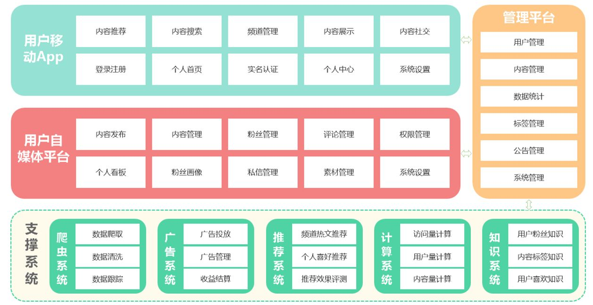
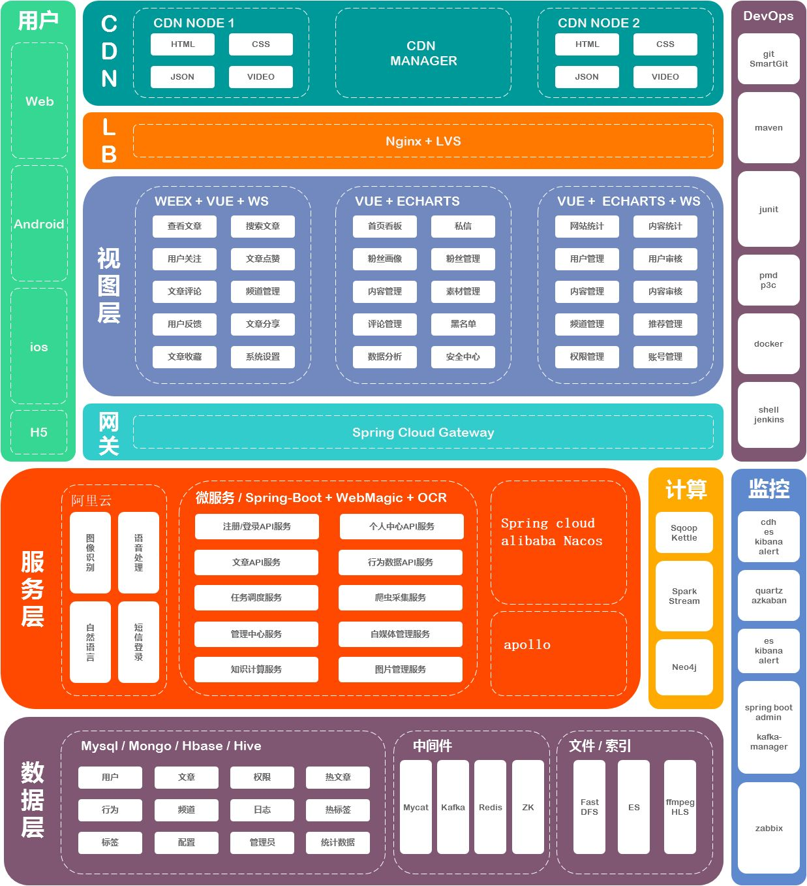

类似于今日头条的咨询类项目，采用前后端分离模式开发，整个项目整体分为平台管理平台、用户自媒体平台以及移动 APP 端。
前端整体使用 Vue2 开发，app 采用阿里的 weex 框架，可以提供 h5、android 以及 ios 的发布方案。
后端主要使用SpringBoot+SpringCloud 的微服务架构，nginx 接收用户请求，反向代理到网关 SpringCloud Gateway，注册中心和配置中心使用的是 nacos，服务之间调用使用 feign rpc，整合了客户端负载均衡 ribbon，使用 hystrix 做服务熔断，seata 做分布式事务，xxljob 处理分布式调度；核心数据存 mysql，redis 做缓存，es 做检索，使用 mongodb 存储非结构化数据，kafka 做日志收集和流式计算。

## 功能架构图

## 技术结构图
